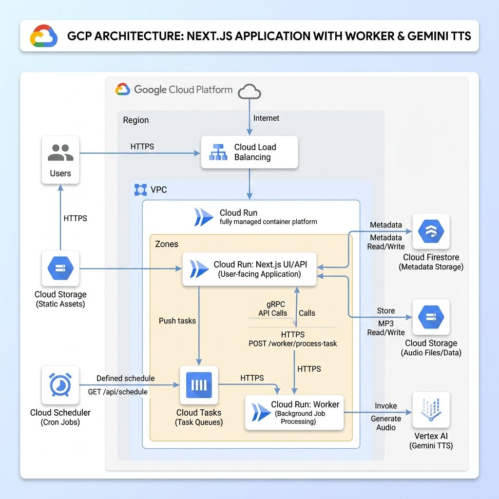

# article-caster

*Your daily read, now your daily listen.*

A personal podcast feed generator that converts web articles into spoken-word audio. Paste an article URL, and article-caster will extract the text, synthesize it into natural-sounding speech using Vertex AI Gemini TTS, and add it to a private podcast feed you can subscribe to in any podcast app.

## Features

- **Article-to-Audio Ingestion** — Paste any article or X / Twitter longform post/article URL to extract, clean (with LLM-based boilerplate removal), and convert it into a podcast-grade MP3 episode (processed asynchronously via Cloud Tasks). Markdown content is cleaned of syntax artifacts, and text is chunked into cohesive ~1,800 to 2,200-character segments along paragraph/sentence boundaries (never mid-word) to prevent prosody resets, silence gaps, or volume shifts.
- **Network Resilience & Automatic Retries** — Ingestion workflows and Vertex AI TTS operations are protected by adaptive retry policies with exponential backoff, jitter, and tuned request timeouts to transparently recover from transient network drops, undici header timeouts, and API rate limits.
- **Content Quality Gate** — Extracted content is validated by Gemini before reaching TTS. Login walls, paywalls, error pages, and other non-article content are automatically rejected with a clear error, protecting podcast subscribers from garbage episodes.
- **PDF Document Ingestion** — Drag-and-drop or upload any PDF document (up to 20MB) or provide a URL pointing to a PDF. The document is uploaded to Google Cloud Storage (GCS) and parsed natively with Gemini 3.5 Flash to automatically strip watermarks, page numbers, academic citations, affiliations, and bibliographies, leaving a clean, continuous-reading audio podcast narrative.
- **YouTube Video Ingestion** — Paste any YouTube URL to preserve and download the original video (targeting 1080p resolution or lower) in MP4 format, and add it to your mixed audio/video podcast feed (requires local development environment due to datacenter IP blocking). If the feed has a custom audio prefix message configured, article-caster automatically synthesizes the message and renders a matching video intro title card, seamlessly concatenating them using fast, lossless stream copying.
- **AI Episode Summaries** — Each episode automatically gets a concise, Gemini-generated description displayed in podcast players.
- **Audio Mastering** — Encodes MP3 (128 kbps CBR, 44.1 kHz mono) and applies loudness normalization (-16 LUFS, -1.0 dBTP) via FFmpeg for professional podcast audio.
- **RSS Syndication** — Subscribe your custom feeds to external RSS sources to automatically ingest new blog posts on a daily schedule, preserving true original publication dates, RSS feed item titles, and exact chronological order. Episode lists clearly show the source RSS feed / blog section name alongside the domain for easy distinction.
- **Podcast Feed Management** — Create and manage multiple podcast feeds, each with its own title, description, author, cover image, TTS voice, and custom audio prefix message.
- **Episode Publishing Rate Limiter & Scheduled Queue** — Prevent subscriber feed flooding by configuring a publishing rate limiter (e.g. 1 episode per weekday at 08:00 UTC). Mastered episodes are safely queued and released by an hourly Cloud Scheduler dispatcher, with manual "Publish Now" controls and instant queue flushing if disabled.
- **Public & Private RSS Feeds** — Each feed gets a unique, unguessable URL. A beautiful, custom public subscription landing page (`/subscribe/[slug]`) allows subscribers to easily subscribe on Apple Podcasts, Pocket Casts, Overcast, or copy the raw RSS XML feed.
- **Google Chat Notifications** — Optionally post rich episode cards to a Google Chat space. Cards show origin type (📰 Article / 📡 RSS / 🎬 YouTube / 📄 PDF), AI-generated summary, source domain, duration, and direct button links to watch/listen, subscribe on the public landing page, and watch/read the original content. Episodes from the same feed are threaded together, with a prompt encouraging discussion.
- **Activity Log** — Per-feed activity log tracking ingestion events, RSS sync results, Chat notification outcomes, and feed management actions. Auto-refreshing modal with URL filtering and log clearing capabilities.
- **Admin Authentication** — Simple passcode-based login to protect the admin dashboard.
- **Content Management** — Play/listen to generated audio or watch original video via a premium glassmorphic popup overlay video player directly in the admin UI, and remove items from feeds.

## Architecture



| Service | Purpose |
|---|---|
| **Cloud Run** | Hosts the Next.js application (admin UI + API routes + RSS feed endpoint). Also performs FFmpeg audio mastering. |
| **Cloud Firestore** | Stores metadata for feeds, items, and ingestion records |
| **Cloud Storage (GCS)** | Stores generated MP3 audio files, publicly accessible for podcast clients |
| **Cloud Tasks** | Queues and processes long-running article ingestion jobs asynchronously |
| **Cloud Scheduler** | Triggers daily RSS syndication cron job |
| **Vertex AI (Gemini TTS)** | Synthesizes article text into natural-sounding audio using Gemini 3.1 Flash TTS |

## Tech Stack

- **Framework**: Next.js 16 (App Router)
- **Infrastructure**: Google Cloud Run, Firestore, Cloud Storage, Cloud Tasks, Cloud Scheduler
- **TTS**: Vertex AI Gemini 3.1 Flash TTS
- **Audio Processing**: FFmpeg (`fluent-ffmpeg`) for MP3 encoding and podcast-standard loudness normalization
- **Article Extraction**: Primary direct fetch with Jina Reader API fallback (parsed via `@mozilla/readability` + `jsdom`), and FxTwitter API proxy for X / Twitter longform articles
- **Podcast Feed**: `podcast` npm package (RSS 2.0 with iTunes extensions)

## Getting Started

### Prerequisites

- Node.js 24+
- A Google Cloud project with Firestore, Cloud Storage, Cloud Tasks, and Vertex AI APIs enabled

### Environment Variables

Copy `.env.example` to `.env` and fill in your values:

| Variable | Description |
|---|---|
| `ADMIN_PASSCODE` | Passcode for admin dashboard login |
| `GOOGLE_CLOUD_PROJECT` | Your GCP project ID |
| `GCS_BUCKET_NAME` | Cloud Storage bucket name for audio files |
| `GOOGLE_CLOUD_REGION` | GCP region for Cloud Run and Firestore (e.g., `europe-north2`) |
| `CLOUD_TASKS_REGION` | GCP region for Cloud Tasks queue (e.g., `europe-west1`) |

### Local Development

1. Copy `.env.example` to `.env` and fill in your values.
2. Install dependencies:
   ```bash
   npm install
   ```
3. Run the development server:
   ```bash
   npm run dev
   ```
4. Open [http://localhost:3000](http://localhost:3000).

## Deployment

Deploy to Google Cloud Run:

```bash
./cloud-deploy.sh
```

Tear down all infrastructure:

```bash
./cloud-teardown.sh
```

See [SPEC.md](.agents/SPEC.md) for full application specification.
